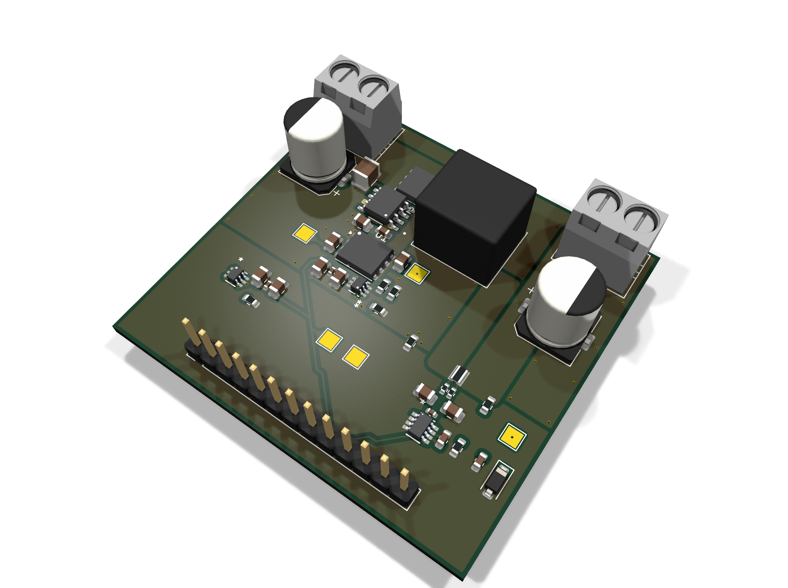

# Digital Synchronous Buck Converter

12 V to 6 V, 10 A synchronous buck converter with closed-loop digital control on an
STM32G474RET6. Custom 4-layer board in KiCad. The firmware runs a 400 kHz PI voltage
loop with hardware-enforced dead-time and a comparator overcurrent trip that doesn't
depend on the CPU.

<!-- TODO
     - scope captures: switching node, gate drive dead-time, load step
     - characterization numbers, then update Status
     - write up why the F.Cu pour and In2.Cu are shaped the way they are
     images are all generated, see docs/regenerate-images.md
-->

## Specifications

| Parameter | Value |
|---|---|
| Input / output | 12 V → 6 V, 10 A |
| Board | 53.1 × 50.0 mm, 4-layer |
| Controller | STM32G474RET6 (Nucleo-G474RE) |
| Switching frequency | 400 kHz (TIM1 at 170 MHz, ARR = 424) |
| Control loop | Voltage-mode PI, one update per switching period (2.5 µs) |
| Dead-time | 100 ns, hardware-enforced (TIM1 DTG = 17) |
| Current sense | INA241A3, 50 V/V into a 5 mΩ shunt, so 0.25 V/A |
| Feedback divider | 0.4047619 (ADC sees V_out × gain) |
| Sampling | Dual-simultaneous 12-bit ADC, TIM1 TRGO triggered, DMA |
| Overcurrent protection | TLV3603 comparator into TIM1 BKIN2 |
| Gate driver | UCC27211D half-bridge |

## Status

The power stage works. I've driven it from a function generator and from the test
firmware in `test-firmware/`.

Still open: the main control firmware in `firmware/` hasn't run on hardware yet, so
the closed loop is unproven. The board also hasn't been characterized, so there are
no efficiency, regulation, ripple or thermal numbers. Both are waiting on lab
access, which was shut through August 2026.

## Repository layout

| Path | Contents |
|---|---|
| `hardware/` | KiCad 10 project: schematic, PCB, design rules, library tables |
| `firmware/` | Main control firmware (CubeMX + EWARM) |
| `test-firmware/` | Standalone open-loop PWM bring-up project |
| `fabrication/` | Gerbers, BOM, pick-and-place, interactive BOM |

## Hardware

4-layer stackup with a solid internal ground plane. All four copper layers are
plotted from the top and unmirrored so they line up with each other.

| `F.Cu` — top signal + power | `In1.Cu` — ground plane |
|---|---|
|  |  |

| `In2.Cu` — power / signal | `B.Cu` — bottom signal + ground |
|---|---|
|  |  |

`B.Cu` is meant to stay as close to unbroken ground as I could keep it. It only
carries routing where a connection couldn't be finished on another layer.

Schematic: [docs/schematic.pdf](docs/schematic.pdf). Top-down render:
[docs/board-top.png](docs/board-top.png).

27 BOM lines across 49 placements. Everything in `fabrication/` comes out of the
KiCad fabrication toolkit: gerbers, a JLCPCB-format BOM and centroid file, and an
interactive HTML BOM at `fabrication/bom/ibom.html`.

## Firmware

### Control

`Buck_CtrlLoopISR()` runs at 400 kHz. It's called from a lean direct-register DMA
handler rather than going through HAL dispatch, which keeps it inside the 2.5 µs
budget. V_FB and current sense are sampled at the same instant by the dual ADC and
come back as a single 32-bit DMA word.

PI with anti-windup. Integrator and duty are both clamped to `[0, duty_limit]`, and
the clamps reject NaN so a bad value written at runtime can't reach the duty cycle.
Analog scaling uses precomputed reciprocals to keep division out of the ISR.

Gains, setpoints and the overcurrent trip level are tunable at runtime over SWD with
STM32CubeMonitor. Monitoring variables are read-only.

### Protection

Overcurrent shutdown is pure hardware: the TLV3603 comparator drives TIM1 BKIN2
directly and kills the gates in under 100 ns. It still works with the CPU halted or
hung. The software break callback only does bookkeeping, forcing MOE off, masking
the break IRQ so it can't storm, and latching the fault.

IWDG is set to 2 s, and the main loop only refreshes it while the control ISR
heartbeat is advancing. A stalled ADC or DMA path resets the board to idle instead
of leaving the half-bridge running open-loop.

TIM3 dual-edge input capture timestamps the gate edges in hardware, so the
dead-time at the power stage is measured rather than assumed.

## Test firmware

`test-firmware/` is a separate project for bringing the power stage up before
closing the loop. Open-loop complementary PWM at 400 kHz with the same 100 ns
hardware dead-time. It holds everything off for 500 ms after reset so the rails
settle and the debugger can attach, then soft-starts by walking CCR up 4 counts
every 2 ms, roughly 106 ms from 0 to 50 % duty. Kept separate so the gate drive can
be checked on its own.

## Toolchain

The CubeMX project targets EWARM V8.50. It also builds clean under
`arm-none-eabi-gcc` 14.3 (the one bundled with STM32CubeIDE 2.1.1) at
`-O2 -Wall -Wextra` with no warnings, using about 64 KB of flash and 2.4 KB of RAM.

Flash over ST-Link with STM32CubeProgrammer. CubeMonitor needs the exact `.out` ELF
matching what's on the chip, otherwise the symbol addresses won't line up.

TIM1 and IWDG are both frozen on core halt via DBGMCU, so halting in the debugger is
safe. A halt does leave the gates frozen wherever they were. The BKIN2 kill still
works while halted, but don't halt under load with the OC comparator disarmed.
